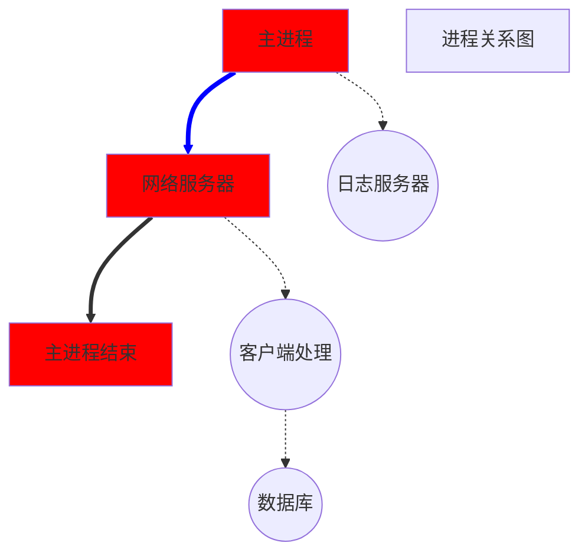
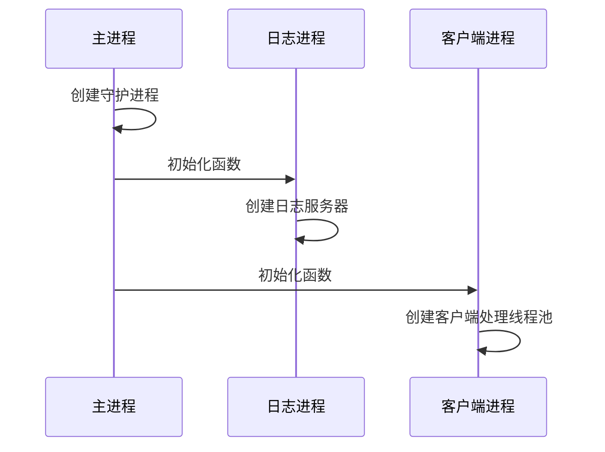
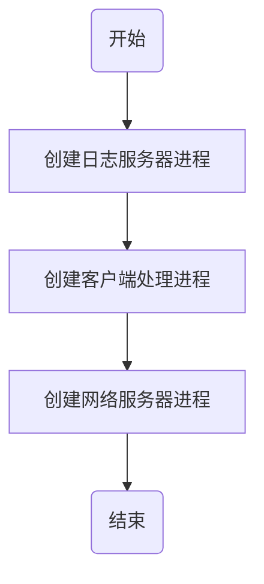
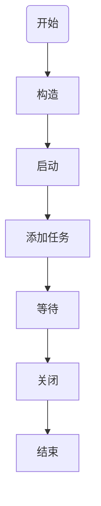
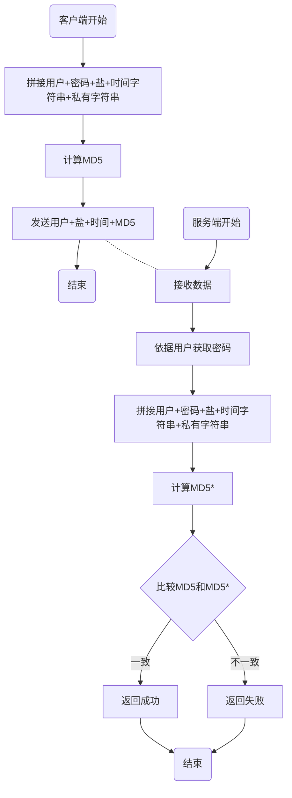
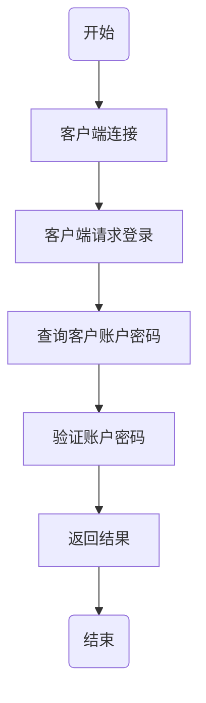
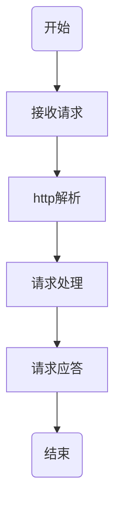

# 易播后台服务器

## 一、 准备工作

### 1. 开发环境搭建

1. 虚拟机VMWare和Ubuntu虚拟机
2. Visual studio 2019
3. SimpleRemote(ssh工具)
4. FileZilla(FTP文件传输工具)

### 2. VS2019的获取和注意事项

​	尽量使用2019社区版

### 3. 易播-虚拟机的网络设置

1. VMware Workstation
2. Ubuntu 18.04 LTS 64-bit

### 4. 易播-SimpleRemote的使用

https://simpleremote-1251449412.cos-website.ap-chengdu.myqcloud.com/

### 5. 易播-FileZilla的使用

https://filezilla-project.org/

### 6. 易播-项目的创建


## 二、进程

### 1. 易播-进程和进程的创建

线程默认是进程内竞争，而进程是操作系统资源分配的最小调度单位。

这也就意味着，如果要充分利用系统资源，最好的形式是多线程多进程模式。

所以我们最好将一个整体功能，分散到多个进程中，从而实现资源利用率的最大化。

否则就只能多个线程在一个进程中进行竞争，没法充分利用系统的资源。

毕竟多个进程竞争资源，比一个进程竞争资源，要有利的多。

下面是我们这个服务器项目要实现的进程结构图




图中方框部分是主进程模块，圆框则是子进程

主进程只负责网络服务器部分，接入客户端，其他一概不管。

日志则由日志服务器进程来处理。

接入客户端后，发送给客户端处理进程。

如果处理过程中需要数据库，则和数据库进程进行交互。

这样，将一个进程完成的事情，分成了四个进程进行。

而且每个进程中可以依据自己的需求，开启多个线程来完成。


在Linux中，开启进程一般通过exec系列函数或者fork函数来完成。

即使是exec函数，也会要使用到fork函数。

所以开启线程，fork函数是无法绕开的。

而fork函数会对线程造成影响，所以我们一定要定好进程结构，然后开启线程。

> 首先，由于线程无法被复制，所以在子进程中，一些线程会消失（没有被复制过来）
>
> 其次，如果程序逻辑依赖多线程模式的时候，fork可能在子进程中破坏掉这种模式，进而使得程序出现无法预料的问题。
>
> 所以一定要先定好进程结构，再去使用线程。



### 2. 易播-进程模块的实现方案

创建进程的流程和结构，我们现在已经知道了。
但是如何实现，还有几个问题，需要我们一个一个去解决。
首先，每个子进程的逻辑并不一样，所需要的参数可能相互冲突。
那么如何满足这些需求呢?
其次，客户端处理进程，需要处理客户端。
我们这是一个网络程序，主进程接收到客户端之后，如何通知子进程去处理呢?
客户端这个时候是一个文件描述符，怎么告诉子进程去处理呢?
所以我们需要两个功能：

- 灵活的进程入口函数

- 进程间传递文件描述符

第二个功能我们稍后再说，我们先讲讲第一个功能
这个功能可以有三种做法:

①使用无属性的指针参数（void*）和固定参数的进程入口函数来实现

②使用面向对象的参数和统一的进程入口函数来实现

③使用模版函数来实现

这三种方式都可以实现，但是方便程度和安全性不一样。

第一种方法**技术上最简单**，但是类型在转换的时候，可能出现问题。而且可以传入的参数数量是固定的，以后其他项目是很难复用此代码。

第二种方法比第一种好了不少。**参数不是固定的，可移植性强了很多**。但是这种方式需要专门写一个参数封装和解析的代码。这种解析代码的复用性会比较差。因为每个进程的任务不一样，参数也不一样，参数的含义也可能大相径庭。

第三种方式难度最大，但是**使用起来最方便，可以移植性最强**。参数可以随时修改，函数也可以是类的成员函数。此外参数无需解析，直接原样转发到目标函数。实现起来也不需要太多的代码，stl里面准备好了许多工具，可以直接使用。就是模版编程不好理解。

我们这里**采用第三种方式来实现**。

### 3. 易播-进程入口函数的实现

### 4. 易播-进程间文件描述符的实现

### 5. 易播-虚拟机如何远程关机

运行`shutdown -P 0`命令

### 6. 易播-进程代码测试

### 7. 易播-守护进程的实现

守护进程实现的关键步骤：

> 1.创建子进程，退出父进程，这样保证守护进程不再是控制终端的进程组首进程，避免意外获取终端信号（如SIGUP）
>
> 2.创建新的会话（脱离控制终端，避免Ctrl+C、SIGUP等的影响），成为新的进程组。注意：如果是进程首进程，`setsid`会失败，因此第一步先`fork`让它变成非首进程。
>
> 3.再次fork并退出上面的子进程，确保进程不能再打开终端。
>
> 4.修改工作目录，避免进程锁定在某个目录，防止因卸载文件系统而阻碍系统重启。
>
> 5.关闭不必要的文件描述符，**关闭标准输入、输出、错误**，序号为0、1、2，避免使用终端，STDIN_FILENO，STDOUT_FILENOSTDERR_FILENO。
>
> 6.处理SIGCHLD信号，如果守护进程需要管理子进程（比如 fork 处理任务），应避免子进程变成僵尸进程

完整代码如下：

```c
#include <stdio.h>
#include <stdlib.h>
#include <unistd.h>
#include <fcntl.h>
#include <sys/stat.h>
#include <sys/types.h>
#include <syslog.h>
#include <signal.h>

void daemonize() {
    pid_t pid = fork();
    if (pid < 0) {
        exit(EXIT_FAILURE);
    }
    if (pid > 0) {
        exit(EXIT_SUCCESS); // 退出父进程
    }

    // 创建新会话
    if (setsid() < 0) {
        exit(EXIT_FAILURE);
    }

    // 防止重新获取终端
    pid = fork();
    if (pid < 0) {
        exit(EXIT_FAILURE);
    }
    if (pid > 0) {
        exit(EXIT_SUCCESS);
    }

    // 修改工作目录
    chdir("/");

    // 关闭文件描述符
    close(STDIN_FILENO);
    close(STDOUT_FILENO);
    close(STDERR_FILENO);

    // 重定向标准输入、输出、错误到 /dev/null
    int fd = open("/dev/null", O_RDWR);
    dup2(fd, STDIN_FILENO);
    dup2(fd, STDOUT_FILENO);
    dup2(fd, STDERR_FILENO);
    close(fd);

    // 忽略 SIGCHLD，防止僵尸进程
    signal(SIGCHLD, SIG_IGN);

    // 打开 syslog
    openlog("daemon_example", LOG_PID, LOG_DAEMON);
    syslog(LOG_INFO, "Daemon started successfully.");

    // 守护进程的主循环
    while (1) {
        syslog(LOG_INFO, "Daemon is running...");
        sleep(10);
    }

    closelog();
}

int main() {
    daemonize();
    return 0;
}

```


### 8. 易播-日志模块的设计

我们一开始的设计就是多进程模式，所以现在可以直接采用进程间通信。

进程间通信，最方便最快速的就是本地套接字通信了。

- 文件通信磁盘速度慢
- 管道在多线程环境下不太方便（可能会出现内容插入）而且是单向的。
- 信号量信息太少
- 内存共享需要反复加锁同步，否则可能会出现问题
- 消息函数(sendmsg、recvmsg)需要创建时确定
- 网络套接字需要额外的IP和端口

所以本地套接字是最佳选择

- 无需IP和端口，不影响服务器对外的资源
- 信息无需加锁，可以多线程并发写
- 数据传输量巨大，传输速率高（纯内存读写）

日志模块的设计图


### 9. 易播-Epoll的封装

epoll简单模型


### 10. 易播-进程间通信的设计

### 11. 易播-套接字接口类封装

### 12. 易播-本地套接字实现

### 13. 易播-线程的封装

## 三、 日志模块

日志系统采用客户端-服务端架构设计，通过本地Unix域套接字实现跨进程日志收集功能。其核心工作流程可分为三个主要阶段：

1. 服务端初始化阶段
   日志服务端在启动时会执行以下初始化操作：

- 创建日志存储目录（./log）
- 根据当前时间生成日志文件名（格式为YYYY-MM-DD_HH-MM-SS.ms.log）
- 绑定Unix域套接字（./log/server.sock）
- 启动epoll事件监听线程

2. 客户端日志记录阶段
   当应用程序调用Trace接口时：

- 首次调用会在各线程中初始化thread_local的客户端socket
- 将日志信息（包括文件名、行号、进程ID等元数据）序列化为Buffer格式
- 通过已建立的套接字连接将日志数据发送至服务端

3. 服务端处理阶段
   服务端的事件处理线程持续监听套接字活动：

- 接收客户端发来的日志数据
- 将日志内容写入预先打开的文件句柄
- 立即执行fflush操作确保日志落盘
- 在调试模式下同步输出到控制台

### 14.日志模块的测试

主线程调用

子线程调用

信号触发时调用

日志中包含整数、小数、字符、字符串

日志中包含英文、中文、标点符号

### 15. 主模块的设计

主模块主要就是客户端的接入，然后分发客户端到客户端处理进程去处理

所以逻辑比较清晰（服务器每个模块的逻辑，越简单越好）

下图展示了程序的流程：




服务器的线程函数主要是接收客户端，然后发送到客户端处理进程进行后续处理。

## 四、 线程池

### 16. 线程池的设计




线程池系统的工作流程可以分为以下几个关键阶段

1. 服务端初始化阶段

- 创建线程池实例时，构造函数会生成一个唯一的Unix域套接字文件路径（基于当前时间戳）
- 调用Start()方法时：
  - 创建监听socket并绑定到生成的sock文件路径
  - 初始化epoll实例（所有工作线程共享同一个epoll）
  - 创建指定数量的工作线程，每个线程都运行TaskDispatch()事件循环

2. 客户端提交任务阶段

- 当首次调用AddTask()时：
  - 在当前线程创建thread_local的客户端socket（保证线程安全）
  - 连接到服务端的sock文件路径
- 对每次AddTask调用：
  - 在堆内存创建CFunction对象（封装函数指针和参数）
  - 将该对象的内存地址（通常8字节）通过socket发送
  - 注意：发送的是指针值本身，不是序列化的函数参数

3. 服务端任务处理阶段

- 工作线程通过epoll_wait()监听事件：
  a) 如果是新连接请求：
  - 接受连接并将新socket加入epoll监听
    b) 如果是数据到达：
  - 接收8字节数据（即CFunction对象指针）
  - 通过指针还原函数对象
  - 执行该函数对象（实际调用用户提交的函数）
  - 最后删除该函数对象释放内存

4. 资源清理阶段

- 关闭线程池时：
  - 关闭epoll实例
  - 停止所有工作线程
  - 删除监听socket
  - 移除sock文件

### 17. 线程池的实现

### 18. 线程池的测试

### 19. 主模块的设计


1. **CServer（主进程）**
   - 监听端口，接受客户端连接
   - 将新连接的客户端Socket通过**进程间通信**（IPC）传递给CEdoyunPlayerServer
   - 自身不处理业务逻辑

### 20.客户端处理模块的设计


1. **CEdoyunPlayerServer（子进程）**
   - 接收CServer传递的客户端Socket
   - 将Socket加入Epoll事件监听
   - 通过线程池处理数据收发
   - **执行实际业务逻辑**（通过Connected/Received回调）

### 21.客户端处理模块的实现

## 五、HTTP

### 22. HTTP模块的设计

封装的作用

- 降低使用成本
- 对外屏蔽细节（低耦合）
- 增加可移植性
- 与更过同类数据关联（高内聚）

### 23.HTTP模块的实现

###  24. HTTP模块的测试


## 六、 数据库模块

### 25. 数据库模块的设计

数据库操作四步流程

1. **连接** - 认证并建立数据库连接
2. **执行** - CRUD操作（增删改查）
3. **确认** - 提交或回滚事务
4. **关闭** - 释放连接资源

也可以分为

1. **连接（Connect）**
2. **开启事务（StartTransaction）**
3. **执行操作**
4. **提交事务（Commit）**
5. **回滚事务（Rollback）**
6. **关闭连接（Close）**

事务是数据库操作的**逻辑单元**，它把多个操作打包成一个不可分割的**原子性**整体，要么全部成功，要么全部失败回滚。

**1. 什么是ORM**

ORM（**Object-Relational Mapping**）是一种编程技术，用于在**面向对象语言**和**关系型数据库**之间建立映射关系，让开发者可以用**操作对象的方式**来操作数据库，而不用直接写SQL。

**2. 核心思想**

| 面向对象（OOP）       | 关系型数据库（RDBMS） |
| :-------------------- | :-------------------- |
| **类（Class）**       | **表（Table）**       |
| **对象（Object）**    | **行（Row）**         |
| **属性（Attribute）** | **列（Column）**      |
| **方法（Method）**    | **存储过程/触发器**   |

### 26. 数据库模块的实现


## 七、加密与服务

### 27. 加密模块的设计

考虑到加密模块使用的方便性，工具类更合适，原因如下：

无需声明对象

方法既可以相互独立，也可以相互关联

随取随用，无需配置或初始化




### 28. 加密模块的实现与测试

### 29. 业务的设计与实现

业务流程



服务器处理流程




## 八、测试

### 30. 集成测试

### 31. 项目测试

