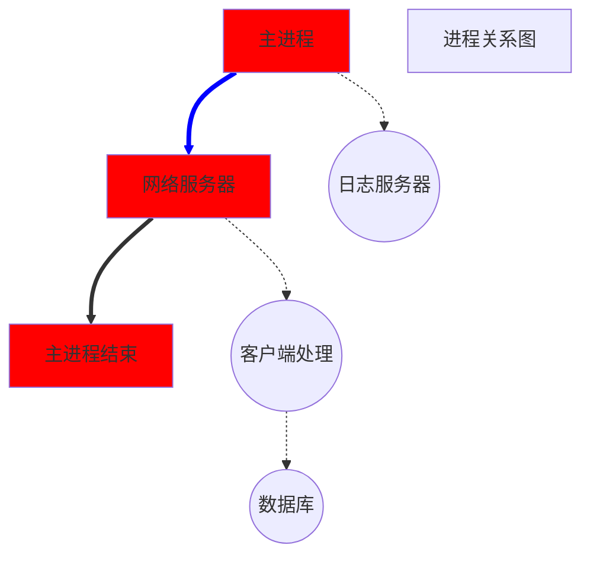
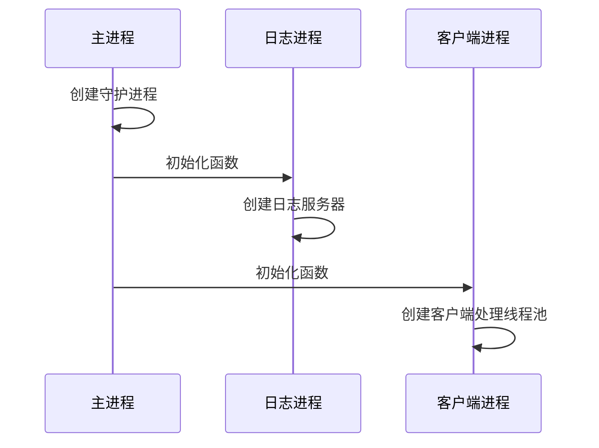

# 易播后台服务器

## 一、 准备工作

### 1. 开发环境搭建

1. 虚拟机VMWare和Ubuntu虚拟机
2. Visual studio 2019
3. SimpleRemote(ssh工具)
4. FileZilla(FTP文件传输工具)

### 2. VS2019的获取和注意事项

​	尽量使用2019社区版

### 3. 易播-虚拟机的网络设置

1. VMware Workstation
2. Ubuntu 18.04 LTS 64-bit

### 4. 易播-SimpleRemote的使用

https://simpleremote-1251449412.cos-website.ap-chengdu.myqcloud.com/

### 5. 易播-FileZilla的使用

https://filezilla-project.org/

### 6. 易播-项目的创建

## 二、进程

### 1. 易播-进程和进程的创建

线程默认是进程内竞争，而进程是操作系统资源分配的最小调度单位。

这也就意味着，如果要充分利用系统资源，最好的形式是多线程多进程模式。

所以我们最好将一个整体功能，分散到多个进程中，从而实现资源利用率的最大化。

否则就只能多个线程在一个进程中进行竞争，没法充分利用系统的资源。

毕竟多个进程竞争资源，比一个进程竞争资源，要有利的多。

下面是我们这个服务器项目要实现的进程结构图

图中方框部分是主进程模块，圆框则是子进程

主进程只负责网络服务器部分，接入客户端，其他一概不管。

日志则由日志服务器进程来处理。

接入客户端后，发送给客户端处理进程。

如果处理过程中需要数据库，则和数据库进程进行交互。

这样，将一个进程完成的事情，分成了四个进程进行。

而且每个进程中可以依据自己的需求，开启多个线程来完成。

在Linux中，开启进程一般通过exec系列函数或者fork函数来完成。

即使是exec函数，也会要使用到fork函数。

所以开启线程，fork函数是无法绕开的。

而fork函数会对线程造成影响，所以我们一定要定好进程结构，然后开启线程。

> 首先，由于线程无法被复制，所以在子进程中，一些线程会消失（没有被复制过来）
>
> 其次，如果程序逻辑依赖多线程模式的时候，fork可能在子进程中破坏掉这种模式，进而使得程序出现无法预料的问题。
>
> 所以一定要先定好进程结构，再去使用线程。

### 2. 易播-进程模块的实现方案

创建进程的流程和结构，我们现在已经知道了。
但是如何实现，还有几个问题，需要我们一个一个去解决。
首先，每个子进程的逻辑并不一样，所需要的参数可能相互冲突。
那么如何满足这些需求呢?
其次，客户端处理进程，需要处理客户端。
我们这是一个网络程序，主进程接收到客户端之后，如何通知子进程去处理呢?
客户端这个时候是一个文件描述符，怎么告诉子进程去处理呢?
所以我们需要两个功能：

- 灵活的进程入口函数

- 进程间传递文件描述符

第二个功能我们稍后再说，我们先讲讲第一个功能
这个功能可以有三种做法:

①使用无属性的指针参数（void*）和固定参数的进程入口函数来实现

②使用面向对象的参数和统一的进程入口函数来实现

③使用模版函数来实现

这三种方式都可以实现，但是方便程度和安全性不一样。

第一种方法**技术上最简单**，但是类型在转换的时候，可能出现问题。而且可以传入的参数数量是固定的，以后其他项目是很难复用此代码。

第二种方法比第一种好了不少。**参数不是固定的，可移植性强了很多**。但是这种方式需要专门写一个参数封装和解析的代码。这种解析代码的复用性会比较差。因为每个进程的任务不一样，参数也不一样，参数的含义也可能大相径庭。

第三种方式难度最大，但是**使用起来最方便，可以移植性最强**。参数可以随时修改，函数也可以是类的成员函数。此外参数无需解析，直接原样转发到目标函数。实现起来也不需要太多的代码，stl里面准备好了许多工具，可以直接使用。就是模版编程不好理解。

我们这里**采用第三种方式来实现**。

### 3. 易播-进程入口函数的实现

### 4. 易播-进程间文件描述符的实现

### 5. 易播-虚拟机如何远程关机

### 6. 易播-进程代码测试

### 7. 易播-守护进程的实现

### 8. 易播-日志模块的设计

### 9. 易播-Epoll的封装

### 10. 易播-进程间通信的设计

### 11. 易播-套接字接口类封装

### 12. 易播-本地套接字实现

### 13. 易播-线程的封装

## 三、 日志模块

## 四、 线程池

## 五、HTTP

## 六、 数据库模块

## 七、加密与服务

## 八、测试

